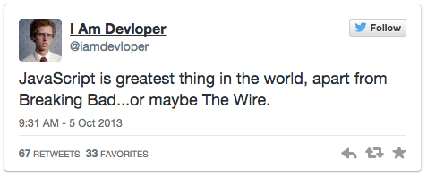

# Intro to JavaScript

## Evan Johnson

---

## About Me

* Front-End Engineer, Amazon<!--- .element: class="fragment" data-fragment-index="1" -->
* Self-taught<!--- .element: class="fragment" data-fragment-index="2" -->
* Loves JavaScript<!--- .element: class="fragment" data-fragment-index="3" -->

---

## About You

* Introduce yourself (i.e. name, what you do, random fact)<!--- .element: class="fragment" data-fragment-index="1" -->
* Why do you want to learn JavaScript?<!--- .element: class="fragment" data-fragment-index="2" -->

---

## Agenda

* What is JavaScript?<!--- .element: class="fragment" data-fragment-index="1" -->
* Tools<!--- .element: class="fragment" data-fragment-index="2" -->
* Functions (intro)<!--- .element: class="fragment" data-fragment-index="3" -->
* Variables<!--- .element: class="fragment" data-fragment-index="4" -->
* Operators<!--- .element: class="fragment" data-fragment-index="5" -->
* Objects<!--- .element: class="fragment" data-fragment-index="6" -->
* Functions<!--- .element: class="fragment" data-fragment-index="7" -->
* jQuery<!--- .element: class="fragment" data-fragment-index="8" -->

---

## Learning Objectives

* Describe JavaScript<!--- .element: class="fragment" data-fragment-index="1" -->
* Create a JS Variable<!--- .element: class="fragment" data-fragment-index="2" -->
* Describe 3 different types of variables<!--- .element: class="fragment" data-fragment-index="3" -->
* Apply JS Operators to:<!--- .element: class="fragment" data-fragment-index="4" -->
  * preform arithmetic<!--- .element: class="fragment" data-fragment-index="5" -->
  * concatenate strings<!--- .element: class="fragment" data-fragment-index="6" -->
  * compare variables<!--- .element: class="fragment" data-fragment-index="7" -->
* Create a JS Object<!--- .element: class="fragment" data-fragment-index="8" -->
* Access a JS Object's properties<!--- .element: class="fragment" data-fragment-index="9" -->

---

# What is JavaScript?

----

## What does Google say?

> [JavaScript is] an object-oriented computer programming language commonly used to create interactive effects within web browsers.

----

## What does Wikipedia say?

> [JavaScript] is a dynamic computer programming language.

----

## How about @iamdevloper?

----

## Client Side vs. Server Side

----

## A Brief History

* LiveScript was created by Brendan Eich in 10 days in May 1995<!--- .element: class="fragment" data-fragment-index="1" -->

* <!--- .element: class="fragment" data-fragment-index="2" --> Eich worked at Netscape, who was trying to enhance Netscape 2.0
* Netscape changed the name to JavaScript in a marketing ploy<!--- .element: class="fragment" data-fragment-index="3" -->
* IE adopted JavaScript in August 1996 when releasing v.3.0<!--- .element: class="fragment" data-fragment-index="4" -->
* Ecma Internation standardized JavaScript in 1999 (ECMAScript)<!--- .element: class="fragment" data-fragment-index="5" -->

---

# Tools

----

## Sublime

* A text editor for code
* http://www.sublimetext.com/

----

## Chrome

* Webbrowser
* Advanced developer tools
* https://www.google.com/chrome/browser/desktop/

----

## Exercise Files

* https://github.com/js-workshops/intro
* Download files using git clone or the ‘Download Zip’ button
* After unzipping the files, copy them to a directory you want to work from (i.e. ~/Document, ~/Desktop)

----

## Console

* Chrome Menu (top right hamburger button) -> Tools -> Developer Tools
* Mac shortcut: Cmd + Opt + i
* PC shortcut: F12, Ctrl + Shift + i

---

# Functions (Intro)

----

## W3Schools

> A JavaScript function is a block of code designed to perform a
> particular task. A JavaScript function is executed when "something"
> invokes it (calls it).

----

## Invoke

> to make use of (a law, a right, etc.)

----

## Invoke (JS)

> To initiate a block of code, that would otherwise not be executed.

----

## Basic Function

<pre><code data-trim class="javascript">
var myFunction = function() {
  // this is a function
  // your code block goes in between the curly brackets {}
}
</code></pre>

----

## Function Parameter(s)

<pre><code data-trim class="javascript">
var myFunction = function(myParameter) {
  // this is a function
  // your code block goes in between the curly brackets {}
  // you can access the parameter by it's name above:
  // myParameter in this case
  console.log(myParameter);
}

</code></pre>

----

<!--- .element: data-background="#CCC" -->

## Exercise

File: 001-functions-intro.html

---

# Variables

----

## Mozilla Developer Network

> You use variables as **symbolic names** for values in your application. The names of variables, called **identifiers**, conform to certain rules.

----

## Variable Rules

* Must start with a letter, underscore (&#95;), or dollar sign($)<!--- .element: class="fragment" data-fragment-index="1" -->
* Subsequent letters can also be digits (0-9)<!--- .element: class="fragment" data-fragment-index="2" -->
* Variable names are case sensitive<!--- .element: class="fragment" data-fragment-index="3" -->

----

## Declaring Variables

Using the *var* keyword, we are able to declare variables to the current scope.

<pre><!--- .element: class="fragment" data-fragment-index="1" --><code data-trim class="javascript">
var x = 18;
</code></pre>

----

## Global Variables

If you don't use the *var* keyword, you will be declaring a global variable.

<pre><!--- .element: class="fragment" data-fragment-index="1" --><code data-trim class="javascript">
x = 18;
</code></pre>

----

## Variable Types

Primitive Variables are the most common type:

| Type          | Example            | 
| ------------- |:------------------:|
| Number        | 42, 3.14159        |
| Boolean       | true / false       |
| Strings       | "howdy"            | 
| undefined     | value is undefined |

----

<!--- .element: data-background="#CCC" -->

## Exercise

File: 002-variables.html

---

# Operators

----

## What is a JavaScript Operator?

> JavaScript operators are **symbols** that can be used to assign values, compare values, preform arithmetic, test logic, manipulate strings, and more.

----

## Types of Operators

* Arithmetic operators<!--- .element: class="fragment" data-fragment-index="1" -->
* Assignment operators<!--- .element: class="fragment" data-fragment-index="2" -->
* String operators<!--- .element: class="fragment" data-fragment-index="3" -->

----

## Arithmetic Operators

| Operator      | Description        | 
| ------------- |:------------------:|
| +             | Addition           |
| -             | Subtraction        |
| *             | Multiplication     | 
| /             | Division           |
| %             | Modulus            |
| ++            | Increment          |
| --            | Decrement          |

----

## Arithmetic Examples

<pre><code data-trim class="javascript">
var x = 3;      // assigns the value 3 to x
x = x + 2;      // assigns the value 5 to x (3 + 2)
x = x - 3;      // assigns the value 2 to x (5 - 3)
x = x * 12;     // assigns the value 24 to x (2 * 12)
x = x / 2;      // assigns the value 12 to x (24 / 2)
x = x % 5;      // assigns the value 2 to x (12 % 5)
x = x++;        // assigns the value 3 to x (x + 1)
x = x--;        // assigns the value 2 to x (x - 1)
</code></pre>

----

## Arithmetic Parenthesis

Parenthesis can be used to indicate which part of an equation you want to evaluate first. 

<pre><code data-trim class="javascript">
var x = 2 * (100 / 5);   // assigns the value 40 to x
</code></pre>

<pre><code data-trim class="javascript">
var x = (100 / 5) * 2;   // assigns the value 40 to x
</code></pre>

----

## Assignment Operators

| Shorthand     | Meaning            | 
| ------------- |:------------------:|
| x += y        | x = x + y          |
| x -= y        | x = x - y          |
| x &#42;= y    | x = x * y          | 
| x /= y        | x = x / y          |
| x %= y        | x = x % y          |

----

## Assignment Examples

<pre><code data-trim class="javascript">
var x = 3;   // assigns the value 3 to x
x = x + 2;   // assigns the value 5 to x (3 + 2)
x = x - 3;   // assigns the value 2 to x (5 - 3)
x = x * 12;  // assigns the value 24 to x (2 * 12)
x = x / 2;   // assigns the value 12 to x (24 / 2)
x = x % 5;   // assigns the value 2 to x (12 % 5)
x = x++;     // assigns the value 3 to x (x + 1)
x = x--;     // assigns the value 2 to x (x - 1)
</code></pre>

<pre><!--- .element: class="fragment" data-fragment-index="1" --><code data-trim class="javascript">
var x = 3;   // assigns the value 3 to x
x += 2;      // assigns the value 5 to x (3 + 2)
x -= 3;      // assigns the value 2 to x (5 - 3)
x &#42;= 12;     // assigns the value 24 to x (2 * 12)
x /= 2;      // assigns the value 12 to x (24 / 2)
x %= 5;      // assigns the value 2 to x (12 % 5)
x = x++;     // assigns the value 3 to x (x + 1)
x = x--;     // assigns the value 2 to x (x - 1)
</code></pre>

----

<!--- .element: data-background="#CCC" -->

## Exercise

File: 003.1-operators.html

----

## String Operators

The + symbol is used as the addition operator with numbers, but it become the concatenation operator with strings. It combines two string values together.

<pre><!--- .element: class="fragment" data-fragment-index="1" --><code data-trim class="javascript">
var x = "two strings " + "becomes one";
// assigns the value "two strings become one" to x
</code></pre>

----

<!--- .element: data-background="#CCC" -->

## Exercise

File: 003.2-operators.html

----

## Comparison Operators

> A **comparison operator** compares its operands and returns a logical value based on whether the **comparison is true**.

----

## Equal and Not Equal

| Operator       | Description                                | 
| -------------- |:------------------------------------------:|
| Equal (==)     | Returns true if the operands are equal     |
| Not equal (!=) | Returns true if the operands are not equal |

----

## Equal and Not Equal (Example)

<pre><code data-trim class="javascript">
var x = 2;   // assigns the value 2 to x
var y = 2;   // assigns the value 2 to y
var z = 3;   // assigns the value 3 to z
x == y       // returns true
x == z       // returns false
x != y       // returns false
x != z       // returns true
</code></pre>

----

## Strict Equal and Not Equal

| Operator               | Description                                                            | 
|------------------------|:----------------------------------------------------------------------:|
| Strict equal (===)     | Returns true if the operands are equal and of the same type            |
| Strict not equal (!==) | Returns true if the operands are not equal and/or not of the same type |

----

## Strict Equal and Not Equal (Example)

<pre><code data-trim class="javascript">
var x = 2;     // assigns the number 2 to x
var y = 2;     // assigns the number 2 to y
var z = '2';   // assigns the string 3 to z
x ==- y        // returns true
x === z        // returns false
x !== y        // returns false
x !== z        // returns true
</code></pre>

----

## Greater Than / Less Than

| Operator                   | Description                                                                    | 
| -------------------------- |:------------------------------------------------------------------------------:|
| Greater than (>)           | Returns true if the left operand is greater than the right operand             |
| Greater than or equal (>=) | Returns true if the left operand is greater than or equal to the right operand |
| Less than (<)              | Returns true if the left operand is less than the right operand                |
| Less than or equal (<=)    | Returns true if the left operand is less than or equal to the right operand    |

----

## Greater Than / Less Than (Example)

<pre><code data-trim class="javascript">
var x = '10';    // assigns the string 10 to x
var y = 2;       // assigns the number 2 to y
var z = 10;      // assigns the number 10 to z
x > y            // returns true
x < y            // returns false
x > z            // returns false
x >= y           // returns true
y >= x           // returns false
x <= z           // returns true
</code></pre>

----

<!--- .element: data-background="#CCC" -->

## Exercise

File: 003.3-operators.html

---

# Objects

----

## Mozila Developer Network

> The Object constructor creates an object wrapper.

----

## Layman's Terms

> A variable is a symbol for one specific values. An object is a symbol that can contain many variables.

----

## Syntax

* Are created with curly brackets ({})<!--- .element: class="fragment" data-fragment-index="1" -->
* Contain key/value pairs separated by a semi-colon (:)<!--- .element: class="fragment" data-fragment-index="2" -->
* The key/value pairs are separated by a comma (,)<!--- .element: class="fragment" data-fragment-index="3" -->

----

## Object Example

<pre><code data-trim class="javascript">
var person = {
  firstName: 'Jane',
  lastName: 'Doe',
  age: 28
};
</code></pre>

----

## Accessing an Object's Properties

<pre><code data-trim class="javascript">
var person.firstName;     // returns 'Jane'
</code></pre>

<pre><!--- .element: class="fragment" data-fragment-index="1" --><code data-trim class="javascript">
var person['firstName'];  // returns 'Jane'
</code></pre>

----

<!--- .element: data-background="#CCC" -->

## Exercise

File: 004-objects.html

---

# Functions

----

## Review W3Schools

> A **JavaScript function** is a block of code designed to perform a particular task. A JavaScript function is executed when "something" **invokes it** (calls it).

----

## Review Invoke (JS)

> To initiate a block of code, that would otherwise not be executed.

----

## Syntax

* Are created with the keyword: <!--- .element: class="fragment" data-fragment-index="1" -->***function name()***
* You can pass in as many parameters inside the parenthesis: <!--- .element: class="fragment" data-fragment-index="2" -->***function name(param)***
* Multiple parameters are separated with commas: <!--- .element: class="fragment" data-fragment-index="3" -->
***function name(param1, param2, param3)***
* You statement/code is wrapped in curly brackets after the parenthesis: 
<!--- .element: class="fragment" data-fragment-index="4" -->***function name() { [statement] };***
* Return one value (i.e. Object, Variable, Function, etc)<!--- .element: class="fragment" data-fragment-index="5" -->
* After the closing curly bracket, you end the function with a semi-colon (;)<!--- .element: class="fragment" data-fragment-index="6" -->

----

## Functions and Vars

Functions can be assigned to variables

<pre><code data-trim class="javascript">
function logName(myName) {
  console.log(myName);
};

logName('John'); // logs 'John' to the console
</code></pre>

<pre><!--- .element: class="fragment" data-fragment-index="1" --><code data-trim class="javascript">
var logName = function(myName) {
  console.log(myName);
};

logName('John'); // logs 'John' to the console
</code></pre>

----

## Encapsulate Logic

<pre><code data-trim class="javascript">
function multiply(x, y) {
  return x * y;
};

var z = multiply(2, 4); // assigns the number 8 to z
</code></pre>

----

<!--- .element: data-background="#CCC" -->

## Exercise

File: 005-functions.html

